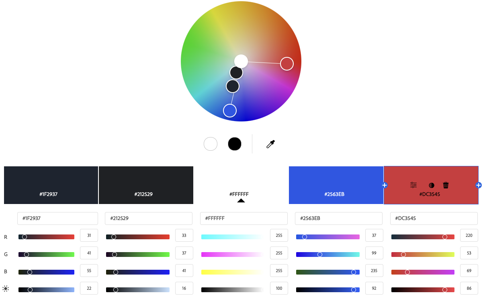

# Gainpace Property

## Purpose

The purpose of gainpace property is to allow me (and friends that are landlords) to advertise properties that they have for rent and for renters to be able to find properties that are for rent.

This is an MVP so the aim is for it to have the base functionality. However, there are many more features and functionality that can be added in the future.

## User Stories

  User Stories have been setup in Github Issues on the repository

### Must Have User Stories

* User Story [#1] - User Registration - As a new user, I want to register for an account so that I can list my properties for rent
  * Acceptance Criteria:
    * User Must provide Username and Password
    * Register link accessible if not logged in
    * Login link accessible if not logged in
    * Logout link accessible if logged in
* User Story [#2] - User Login - As a registered user, I want to log in to my account so that I can access my property listings
  * Acceptance Criteria:
    * Login with username and password
* User Story [#3] - List Property -
As a property owner, I want to create a new property listing so that I can advertise my property to potential renters
  * Acceptance Criteria:
    * 1 image along with all other fields for listing
* User Story [#5] - Property Review System -
As an administrator, I want to review and manage property listings so that I can ensure quality content on the platform.
  * Acceptance Criteria:
    * When a property is added, it should be added as a draft
    * Ability to change the status of a property in the admin area
* User Story [#6] - Property Moderation -
As an administrator, I want to moderate existing property listings so that I can maintain platform quality over time.
  * Acceptance Criteria:
    * Ability to edit properties within the admin area
* User Story [#7] - Public property listings -
As a site visitor, I want to view approved property listings so that I can find properties I'm interested in.
  * Acceptance Criteria:
    * web page that lists the properties that have been approved

### Should Have User Stories

* User Story [#4] - Image Management - As a property owner, I want to upload and manage multiple images for my property so that I can showcase different aspects of the property.
  * Acceptance Criteria:
    * Ability to add more images for a property
    * Ability to be able to change images for a property
    * Ability to delete image for property

## Design Decisions

I have decided to keep the design clean and simple, mainly focusing on the base functionality.

## Apps

The project has 2 apps, Page and Property.

**Property App** Is for the property listings
**Page** App is for the pages on the site such as the home page

## Database

The database is a Postgres database hosted at [Neon Tech](https://neon.tech/).

For this project I've decided that 3 tables are needed extending off the user table provided by Django.

A **Page table** for holding all the information about the pages app.

A **Property table** for holding all the infomation about the proerties.

A **Property images table** for holding the images for the properties.

This should allow a user to have multiple properties and for a property to have multiple images assigned to it.

### Wireframes

  Wirfeframes have been created with the Balsamiq Wireframes program.

  [Wireframes](./assets/images/gainpace-property-wireframes.pdf)
  

#### Colours

I have gone for a simply look and feel for this MVP.

Colours have been tested with [Adobe Color Accessibility Tool](https://color.adobe.com/create/color-accessibility) which says there are no conflicts found.

#### Font

For fonts, I have picked two fonts from [Google fonts](https://fonts.google.com/)

[Montserrat](https://fonts.google.com/specimen/Montserrat) has been selected for the majority of the text on the page.
[Source Sans 3](https://fonts.google.com/specimen/Source+Sans+3) has been selected for the logo.

Font fallbacks are Sans-Serif and then Arial.

#### Images

Images used on the site are either my own images or images that users have uploaded.

No stock images were used making the site.

#### Icons

For icons I have used [Font Awesome](https://fontawesome.com/).

The icons used are .fa-house for the house logo, .fa-cross and .fa-check for the ticks and crosses on the property detail pages.

#### Favicon

The Favicon was made using an online [Favicon Generator](https://favicon.io/favicon-generator/). For the font I have used Montserrat, Extra-bold 800 Normal, font size 70.

## Github

Github has been used for source control and also for its project board and issues tracker for issues and user stories as part of Agile.

### Github Project

  Following Agile I have used to get hump projects to keep track of the project - [Github Project](https://github.com/users/surfdemon/projects/11)

### Github Issues

  Github Issues has been used as part of the Agile process for logging user stories.
  
## Features Implementation

* User Story [#1] - has been implemented using allauth. The base.html template shows the links for sign up link, login link and logout link based on if the current user is authenticated or now. I have used CSS to hide the password requirements and Javascript to show them when either of the password input fields are selected.

* User Story [#2] - has been implemented using allauth.

* User Story [#3] - when a use is logged in they get the option to add a property. A link to the page for this is shown in the menu bar if the ucurrent user is authenticad.

When adding a property, I have used SessionWizardView from formtools. The first form gathers information about the property and the second form lets the user add an image to the property. More images can then be added once the property has been added to the system.

* User Story [#5] - When the property has been added, it is added as a draft and the admin is able to change the status of the property to published in the admin area.
<!-- //TODO - Add the ability to change a property status to publish from the front end as an admin  -->

* User Story [#6] - The adimn can use the admin area to change the status of a property and also change any other details for a property as they see fit.

<!-- //TODO - Make it so that an admin can change the status to draft for a property if they want to from the front end without needing to go into the admin area -->

* User Story [#7] - All properties that have a status of published can be seen on the main properties listing page by any visitor regardless of if they are authenticated or not.

* User Story [#4] - If the user viewing a property is authenticated and they are the owner of the propeprty, they then have tho option of editing the property listing. They have to edit the property details or edit the images for the property. They can delete images, edit images or add more images to the property.

### Navigation

  The navidagion has been implemented using a Bootstrap navbar without an un-ordered list. It is fixed top so that it stays at the top of the screen as you scroll down the page.
  
## Testing and Validation

### Testing Results
  
### Validation

## Deployment

The project is deployed using:

* [Heroku](https://heroku.com/) for hosting Django.
* [Cloudinary](https://cloudinary.com/) for hosting images.
* [Noen Tech](https://neon.tech/) for the postgresql database.

### AI Tools

[Github Copilot](https://github.com/features/copilot) was used to assist with commenting and problem solving.

## Reflection on Developments Process

### Successess  

### Challenges

## Final Thoughts

## Code Attribution

* Bootstrap components such as the navbar and cards, the base code came from the Bootstrap website, based of their example code and then altered.
* Google fonts css snippets taken from the Google fonts site and then altered.

## Final Improvements

<!-- 
TODO: Add info about future enhancements.... 
  - Search feature 
  - Ability to allow people to apply for a viewing through the site if they don't have a Google form link.
  -  
  
  -->