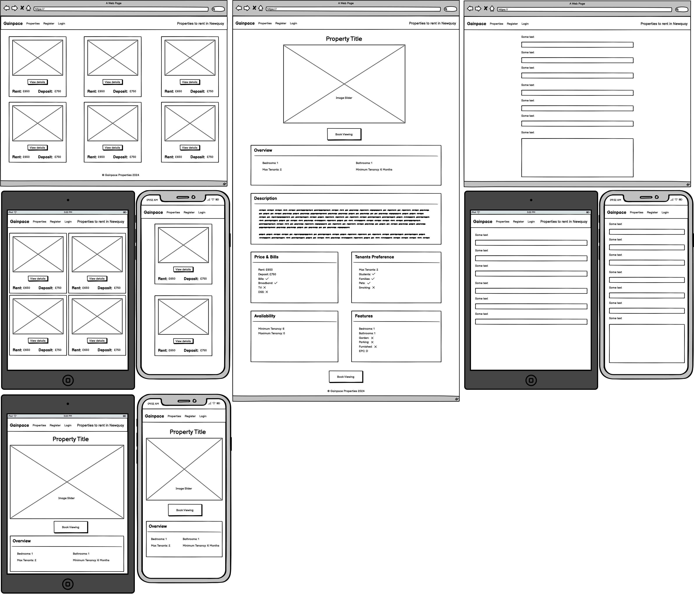

# Gainpace Property

## Purpose 
The purpose of gainpace property is to allow landlords to advertise properties that they have for rent and for renters to be able to find properties that are for rent.   

This is a MVP so the aim is for it to have the base functionality. However, there are many more features and functionality that can be added in the future.

## User Stories 
  User Stories have been setup in Github Issues on the repository 

### Must Have User Stories 
 
* User Story [#1] - User Registration - As a new user, I want to register for an account so that I can list my properties for rent
  * Acceptance Criteria:
    * User Must provide Username and Password 
    * Register link accessible if not logged in 
    * Login link accessible if not logged in 
    * Logout link accessible if logged in
* User Story [#2] - User Login - As a registered user, I want to log in to my account so that I can access my property listings
  * Acceptance Criteria: 
    * Login with username and password 
* User Story [#3] - List Property - 
As a property owner, I want to create a new property listing so that I can advertise my property to potential renters
  * Acceptance Criteria: 
    * 1 image along with all other fields for listing
* User Story [#5] - Property Review System - 
As an administrator, I want to review and manage property listings so that I can ensure quality content on the platform.
  * Acceptance Criteria: 
    * When a property is added, it should be added as a draft
    * Ability to change the status of a property in the admin area
* User Story [#6] - Property Moderation - 
As an administrator, I want to moderate existing property listings so that I can maintain platform quality over time.
  * Acceptance Criteria: 
    * Ability to edit properties within the admin area
* User Story [#7] - Public property listings - 
As a site visitor, I want to view approved property listings so that I can find properties I'm interested in.
  * Acceptance Criteria: 
    * web page that lists the properties that have been approved

### Should Have User Stories 
* User Story [#4] - Image Management - As a property owner, I want to upload and manage multiple images for my property so that I can showcase different aspects of the property.
  * Acceptance Criteria: 
    * Ability to add more images for a property
    * Ability to be able to change images for a property
    * Ability to delete image for property

### Could Have User Stories 

 

## Design Decisions 

## Apps

## Database
For this project I've decided that 3 tables are needed extending off the user table provided by Django. 

A **Page table** for holding all the information about the pages app.

A **Property table** for holding all the infomation about the proerties. 

A **Property images table** for holding the images for the properties. 

This should allow a user to have multiple properties and for a property to have multiple images assigned to it. 

### Wireframes 
  Wirfeframes have been created with the Balsamiq Wireframes program.

[Wireframes](./assets/images/gainpace-property-wireframes.pdf)

  #### Colours

  #### Font 

    
  #### Images 

  #### Icons 

  #### Favicon 

  
## Github 
### Github Issues 
  Github Issues has been used as part of the Agile process for logging user stories. 

  
## Features Implementation 

### Navigation 
  The navidagion has been implemented using a Bootstrap navbar without an un-ordered list. It is fixed top so that it stays at the top of the screen as you scroll down the page.

  
### Core Features (Must Haves)
    

  

  

### Advanced Features (Should Haves)

  

### Optional Features (Could Haves)

  

## Testing and Validation 

### Testing Results 
  

### Validation 

## Deployment 
The project is deployed using: 

* [Heroku](https://heroku.com/) for hosting Django.
* [Cloudinary](https://cloudinary.com/) for hosting images. 
* [Noen Tech](https://neon.tech/) for the postgresql database.

### AI Tools 
[Github Copilot](https://github.com/features/copilot) was used to assist with commenting and problem solving. 

## Reflection on Developments Process 

### Successess  

### Challenges 

## Final Thoughts 

## Code Attribution 

  * Bootstrap components such as the navbar and cards, the base code came from the Bootstrap website, based of their example code and then altered. 
  * Google fonts css snippets taken from the Google fonts site and then altered. 

## Final Improvements
